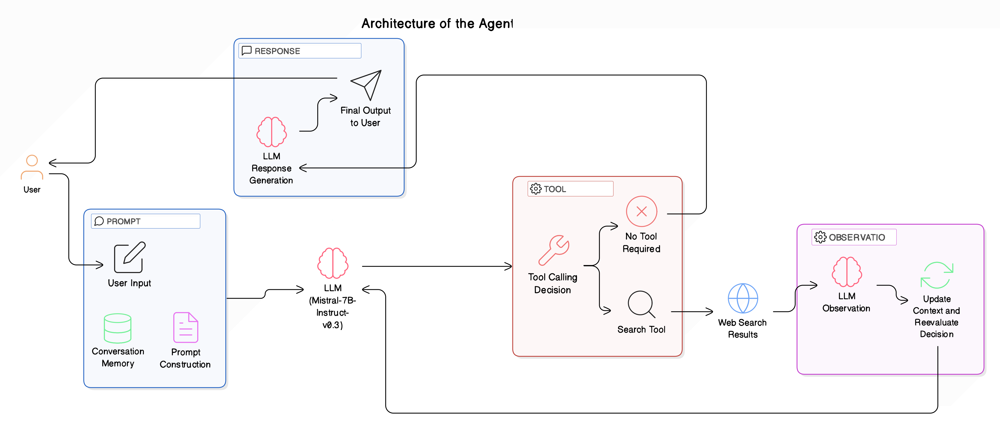
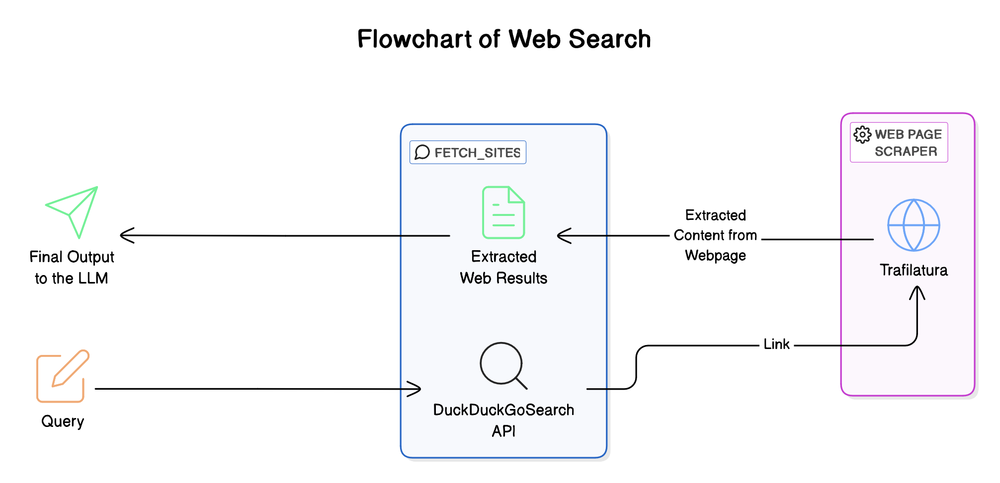

# Agentic RAG

This "agentic" RAG is an interactive conversation application powered by a modern Langchain-based agent that integrates natural language processing, and web search. Built using Streamlit for its user interface, it leverages the Hugging Face endpoint to deliver context-rich, intelligent responses.

## Overview

This Agentic RAG is designed to:
- Answer user questions in detail while explaining the reasoning process.
- Utilize a ReAct chat agent powered by a chain-of-thought prompt based on ReAct.
- Seamlessly integrate with web search and content extraction tools.
- Provide error recovery and session memory, preserving conversation context over time.

## Features

- **Chat Interface:** A modern Streamlit-based chat UI that mimics conversational apps.
- **Chain-of-Thought Reasoning:** Uses a multi-step reactive agent workflow to generate detailed and accurate answers.
- **Tool Integration:** Includes tools for web search and content extraction:
  - *Search Tool:* Uses DuckDuckGo for retrieving web and news results.
- **Caching & Memory:** Employs an in-memory cache to optimize LLM calls and conversation memory to maintain context throughout sessions.

## Architecture

The architecture combines LangChain’s modular framework with Streamlit’s client-server model. Below is an architectural diagram showcasing the inner working of the agent:



## Search Tool

The system's web search and scraping process works as follows:
1. The user's query is processed by the **Search Tool**
2. This query is passed to the DuckDuckGo API.
3. The top 3 results from each category ('news' and 'text') are selected for further processing.
4. These URLs are then sent to the web page scraper component

The system utilizes a dedicated web page scraper component that:
- Uses Trafilatura for efficient content extraction
- Cleans and structures web content for optimal retrieval
- Extracts relevant information while filtering out non-content elements

The web page scraper works in conjunction with the Search tool to transform raw web search results into structured, consumable content for the RAG pipeline.



## Evaluation Report

The project includes a comprehensive evaluation of the RAG agent across three sample queries, carefully selected to demonstrate its capabilities across diverse knowledge domains:

1. Neo4j knowledge assessment (technical domain)
2. Current news updates (timely information retrieval and structured response)
3. iPhone 16 vs Samsung Galaxy S25 comparison (comparative analysis)

For each query, the evaluation process documents:
- The exact query presented to the agent
- Raw web search results retrieved by the search tool
- Content extracted by the Search tool
- Complete response generated by the agent

This evaluation showcases the agent's ability to:
- Process complex technical questions
- Retrieve up-to-date information from the web
- Generate comprehensive, well-structured responses

The documented examples provide insight into how the RAG agent processes information at each stage of the pipeline, from initial query to final response synthesis.

For complete evaluation details and response analysis, see the [Evaluation Report](evaluation/Evaluation_Report.md).

## Installation

1. **Clone the Repository:**

   ```
   git clone https://github.com/cricsion/Agentic-RAG.git
   cd Agentic-RAG
   ```

2. **Create and Activate a Virtual Environment:**

   ```
   python -m venv env
   source env/bin/activate   # On Windows use: env\Scripts\activate
   ```

3. **Install Dependencies:**

   Ensure you have Python 3.8 or higher installed and then run:

   ```
   pip install -r requirements.txt
   ```

## Configuration

- **Environment Variables:**

   Create a `.env` file in the project root with the following variables:

   ```
   MODEL=<your_huggingface_model_id>
   HUGGINGFACEHUB_API_TOKEN=<your_huggingface_api_token>
   ```

   These variables are used to:
   - Specify the Hugging Face model repository.
   - Authenticate with the Hugging Face Hub.


## Usage

1. **Run the Application:**

   Start the Streamlit app by running:

   ```
   streamlit run src/main.py
   ```

2. **Chat with the Agent:**

   - Upon launching, you will find an interactive chat input.
   - Enter a query and watch as the agent uses its integrated tool (web search) to formulate its answer.
   - The agent process embeds a "chain-of-thought" style output making sure that each step is clear and it only finalizes its answer after all tool outputs are processed.

## Technical Details

- **Agent Initialization:**  
  The agent is created using a React-based workflow that integrates with [Langchain’s chat models](https://github.com/hwchase17/langchain) and a Hugging Face endpoint. It ensures the output includes step-by-step reasoning.

- **Caching & Memory:**  
  - An in-memory cache is set up to optimize LLM calls.
  - ConversationBufferMemory is used to store chat history and maintain context.

- **Error Handling:**  
  An error recovery function is in place using Streamlit’s dialog components. In case of errors, users are offered an option to reset the session.

## Troubleshooting

- If you experience issues or errors in the UI, use the provided “Error Recovery” dialog. Clicking the reset button clears the session state and reruns the application.
- Confirm that the environment variables in your `.env` file are correctly set.
- Check that all dependencies are properly installed, especially if you see issues with FAISS or Hugging Face integrations.
- Make sure that the model supports tool/function calling.

## Contributing

Contributions are welcome! Please submit issues or pull requests to enhance the features, fix bugs, or improve documentation. When contributing, ensure your code adheres to the project’s coding conventions and update the README as needed.

## License

This project is distributed under the MIT License. See the LICENSE file for details.

---
